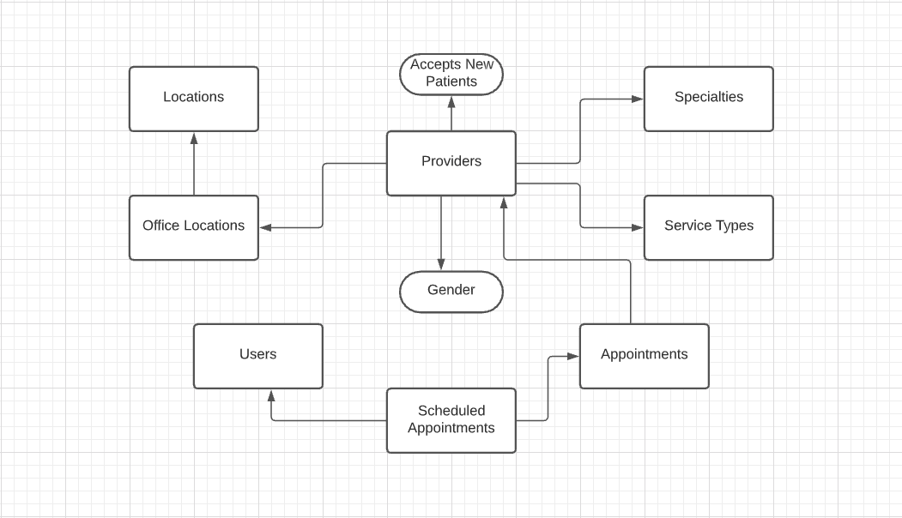

## Homework Assignment #12: Object Oriented Programming.

### What is Object Oriented Programming?

Object Oriented Programming (OOP) models real world things that we want to represent in a software system. Objects are the central part of OOP based applications. Real world objects have properties and these objects can perform actions. The actions are the methods that the object can do. For example, a human is an object. A human can be defined using properites such as name, age, birthdate, height, weight, skin color etc. A human can perform certain actions. We can define human object actions such as walk, talk, breath, eat, sleep. 

### Why do we use OOP?

OOP is easy to understand, because in many ways it mimics the real world. Objects contain data and can perform some logic based on their data. Objects have methods (procedures, or functions) that operate on the data the objects contain. A class is a blueprint in OOP that is often used to instantiate objects. 

Inheritance is a powerful tool for avoiding redundancy. Inheritance lets you create a new class by extending an existing class with additional properties and methods. The new class "inherits" all of the features of its parent, avoiding the copying/creation of new code from scratch. Additionally, any changes made to the parent class will automatically be available to the child class. This makes code updates much easier.

OOP also provides for encapsulation, which prevents access to data except through the object's methods.

### When do we use OOP?

A JavaScript application is written in functional, event-driven  or OOP patterns.

The event-driven programming style is suitable for UI specific event handling such as button click, keyup, mouseover or to create interactive web applications.

The functional pattern is more declarative and application state flows through pure functions. The functional pattern is suitable for data manipulation and for providing different ways to present data to the interface. 

The OOP pattern is suitable when an application has to perform CRUD functionalities. Specially, use the OOP pattern to pass data back and forth between the front-end application and back-end processing logic. This helps to maintain modularity of the code and allows us to identify which data interacts with the application. 

### Example use of OOP in a project

Let's use the example of an medical services company's website. The objective of this system is to allow a user to browse/search through a list of medical providers (doctors, etc.) based on their office location and required specialty, and then allow the online user to schedule an office appointent with the selected provider. 

### User Stories for a Medical Provider Appointment Scheduling System

- As a user, I want to browse all providers.
- As a user, I want to search for providers by location.
- As a user, I want to search for providers by medical specialty.
- As a user, I want to search for providers by gender.
- As a user, I want to search for providers by whether the provider is accepting new patients.
- As a user, I want to register with the system so that I can schedule an appointment.
- As a registered user, I want to log in to the system so that I can schedule an appointment.
- As a registered user, I want to schedule an appointment.
- As a registered user, I want to change password, email address and any other contact information, such as phone number.

### Object Diagram

